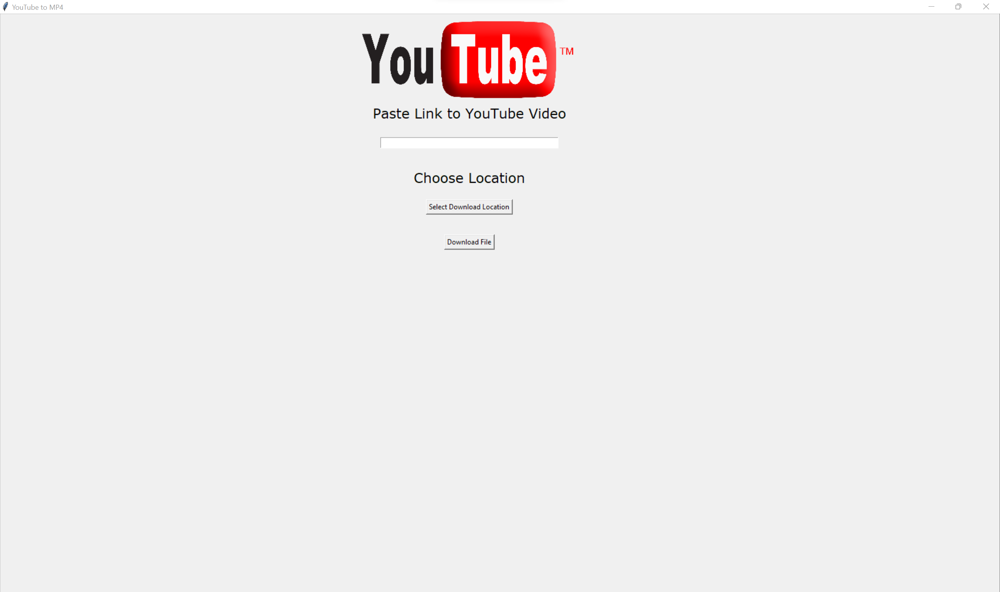

# Software Used
- Python
- Visual Studio Code 

# Inspiration for YouTubeToMP4
Have you ever come across a video on YouTube you loved so much? Enough to want to download it into your local system/device? Well, with this YouTube to MP4 software, countless of YouTube videos are now ready to download at your disposal.

# Preconditions
- Intall a Python IDE such as PyCharm, IDLE, or Visual Studio Code
- Run pip install moviepy and pip install pytube into your local terminal

# Run YouTubeToMP4
Simply run the Python file in your own IDE and the application window should appear in seconds.

# How To Use
Paste a YouTube video link into the application and click download. The downlodad will appear in the IDE you choose to run the application on. You can also choose a path location in your explorer to save the video in.

# Next Steps
I am currently working on improving the design and readibility of the application's user interface. Additionally, I am planning on adding more features such as MP3 conversion.
